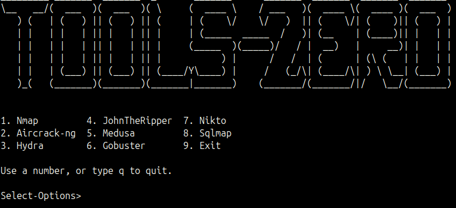

# Tools Zero

Tools Zero is a collection of simple Python wrappers and a CLI/menu interface for various security and penetration-testing tools organized under the `toolkit/` directory.

## Overview

This project provides helper scripts to simplify running several popular tools:
-Nmap
-Aircrack-ng
-Hydra
-JohnTheRipper
-Medusa
-BruteSuite
-Gobuster
-Nikto
-Sqlmap
-TCP Relay (safe local C++ traffic relay for debugging)

via a unified menu and small wrapper scripts. The goal is to centralize utilities, short documentation, and install scripts in a single repository for local use on Linux systems.

## Key Features

- Menu/CLI interface to select and run supported tools.
- Wrappers for multiple tools located in `toolkit/` (examples: `aircrack-ng`, `nmap`).
- A built-in C++ local TCP relay that compiles on demand for service debugging on loopback.
- Installation and uninstallation scripts at `scripts/install_tools.sh` and `scripts/uninstall_tools.sh`.

## Project structure (short)

- `main.py` — Main entrypoint.
- `cli.py`, `menu.py` — Command-line and menu interfaces.
- `toolkit/` — Subfolders for each tool and related helpers.
- `scripts/` — Installation and uninstall scripts.
- `banner.py` — CLI banner/branding.

## Requirements

- Operating system: Linux (recommended).
- Python 3.x installed.
- External tools you intend to use (e.g. `aircrack-ng`, `nmap`) — some can be installed via `scripts/install_tools.sh`.
- `g++` if you want to use the built-in `TCP Relay` module.

## Installation

1. Ensure Python 3 is available on your system.
2. (Optional) Run the install script to install supported dependencies and tools:

```bash
bash scripts/install_tools.sh
```

3. Run the application:

```bash
toolszero
```

Or run it directly with Python:

```bash
python3 main.py
```

Or use `cli.py` for command-line options:

```bash
python3 cli.py
```

## Usage

After starting the program, use the menu to choose a tool to run, or execute individual helper scripts inside `toolkit/` directly (for example: `toolkit/nmap/main_nmap.py`). Check each tool's `help_commands.py` in its subfolder for specific usage instructions.

`TCP Relay` is intentionally scoped to bind only on loopback addresses (`127.0.0.1`, `localhost`, or `::1`) so it can be used as a local debugging helper for systems and services you control, rather than as a general interception tool.

## Preview

Below is a screenshot of the current interface:



## Contributing

- Open an issue to report bugs or propose improvements.
- Fork the repository, create a feature branch (`feature/xxx`), and submit a pull request.
- See [CONTRIBUTING.md](CONTRIBUTING.md) for the contribution workflow and review checklist.

## Status Project

The current project status is under development.

## Notes

This project aggregates wrappers and scripts that may facilitate the use of tools which require special permissions or responsible usage. Only run these tools on systems you own or where you have explicit permission.
